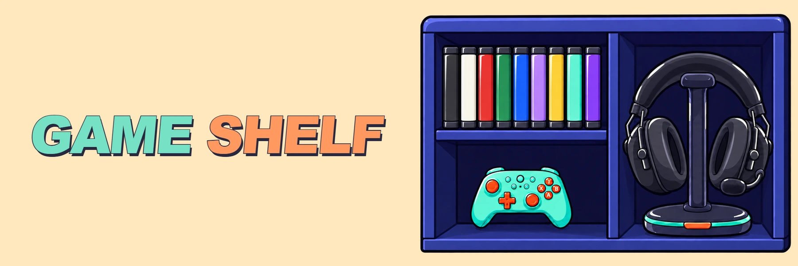

**Live:** [bytiagodev.github.io/game-shelf](https://bytiagodev.github.io/game-shelf/)

A little place to keep the games I've played, with a case for each game and notes to remind me what I thought of it at the time.

Game Shelf is my personal Steam journal. I add entries manually, starting with 2026, and open their cases to see a cover, lifetime playtime, last-played date and dated notes. The illustrated cabinet grows into more rows as the collection grows.

## What it does

- One case per game, with 18 sleeve colours and a cover inside.
- Search, year and genre filters, plus sorting by title or last played.
- A small genre breakdown for the selected year.
- Dated notes that keep earlier impressions when I return to a game.
- Responsive shelves and game details that work with a keyboard.

Built with **React, JavaScript, Vite and plain CSS**. Case titles and controls are HTML. No automatic Steam sync, account system or backend.

Games are entered by hand with dates and lifetime hours checked in Steam. When the game list is empty, the app shows a clearly labelled fictional collection.

## Run locally

Use Node 20.19+ or 22.12+.

```sh
npm ci
npm run dev
```

```sh
npm test
npm run build
npm run preview
```

`npm run build` creates the static site in `dist/`, with relative asset paths suitable for GitHub Pages.

## Add a game

Edit `src/data/games.js`. Each game is one object; adding the first real entry replaces the fictional collection.

```js
export const games = [
  {
    id: 'your-game',
    title: 'Your game',
    steamAppId: null,
    genres: ['Adventure'],
    year: 2026,
    lastPlayed: { date: '2026-09-01', precision: 'month' },
    totalHours: null,
    coverUrl: null,
    color: '#75e1c4',
    ink: '#28283e',
    notes: [
      { date: '2026-10-04', text: 'A thought to keep for later.' },
    ],
  },
];
```

- `id` is a unique, stable identifier. `year` chooses the shelf year.
- `lastPlayed` can be `null`, an exact date with `precision: 'day'`, or an approximate month with `precision: 'month'`. For a month, use its first day for sorting; the interface displays only the month and year.
- `totalHours` is the lifetime total copied from Steam. Use `null` if unknown; zero remains zero. It does not represent hours played that year.
- `steamAppId` enables the Steam store link. `coverUrl` supplies that game's own cover; missing or failed images have a title fallback.
- For a game inside a Steam collection, use its individual title and the collection's app ID and cover. The optional `steamCollection` field identifies that collection in the details panel.
- `color` selects the nearest illustrated sleeve colour. `ink` sets the fallback cover's title colour.
- Use `notes: []` when there are no notes. Append a dated note when returning to a game and update `lastPlayed`, keeping one case for it.
- Games can have several genres, so genre counts may overlap. The breakdown covers the selected year, even when the shelf is filtered.

The `profile` object in the same file sets the collection's starting year.

Historical dates may be approximate or unknown. Lifetime Steam hours cannot reconstruct yearly hours or session counts. New entries and notes can be more precise as I record them.

## Artwork

The illustrations were generated with AI.
